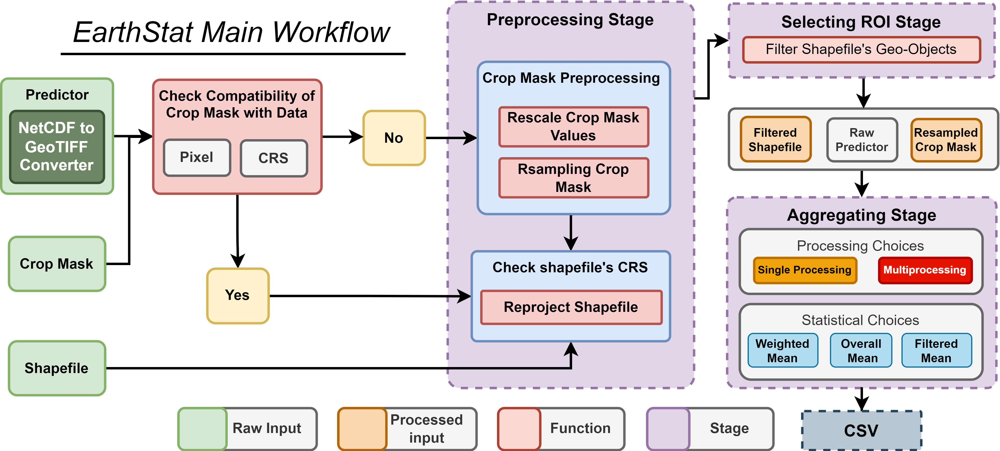

# Welcome to EarthStat

**A Python package for efficiently generating statistical datasets from raster data for spatial units.**

* GitHub repo: [https://github.com/AbdelrahmanAmr3/earthstat](https://github.com/AbdelrahmanAmr3/earthstat)
* Documentation: [https://abdelrahmanamr3.github.io/earthstat](https://abdelrahmanamr3.github.io/earthstat)
* PyPI: [https://pypi.org/project/earthstat](https://pypi.org/project/earthstat/)
* Free software: MIT license

## Introduction

Drawing inspiration from participating in the AgML community's "Regional Crop Yield Forecasting" activity, I've developed a Python library to build benchmarks for training Machine Learning models. As the sole developer, I've focused on creating a tool that efficiently processes large volumes of TIFF files, extracting statistical information and converting raster data into easily manageable CSV files. This library is particularly suited for training Machine Learning (ML) models or conducting in-depth environmental analyses.

## EarthStat Workflow
This diagram illustrates the workflow of the geospatial data processing implemented in EarthStat from the initialized dataset to the created CSV file.

## EarthStat's Features

EarthStat revolutionizes the extraction of statistical information from geographic data, offering a seamless workflow for effective data management:

- **Data Initialization & Geo-metadata Readability:** Streamlines the incorporation of datasets into EarthStat workflow, and getting insights of vital geo-metadata for data (Raster, Mask, Shapefile).

- **netCDF Conversion:** Seamlessly integrates netCDF files into the workflow, converting them effortlessly into GeoTIFF format.

- **Data Compatibility Assurance:** Simplifies ensuring data compatibility, swiftly identifying and addressing geo data discrepancies among initialized data (Raster, Mask, Shapefile).

- **Automated Resolution of Compatibility Issues:** EarthStat resolves compatibility concerns, employing automatic resampling or reprojecting techniques for masks, and appropriate projection adjustments for shapefiles.

- **Targeted Region Selection:** Easily filter the shapefile to the targeted region.

- **Data Clipping:** Allows for clip raster data to specific shapefile boundaries.

- **Advanced Statistical Data Extraction:** Offers a variety of statistical aggregation methods.

- **Efficient Parallel Processing:** Leverages the power of multiprocessing, significantly accelerating data processing across extensive datasets for quicker, more efficient computation.

## EarthStat Python Library - Improvements Roadmap
### Data Processing and Scenario Management Enhancements 
- [x] offering more statistical options for aggregation.
- [ ] Introduce thresholding option for masks to refine data selection.
- [ ] Refactor Dataloader and Data Compatibility for no mask scenario.

### Automation for User Convenience
- [ ] Implement automatic detection of the lag between date ranges of predictor data.
- [ ] Automatically identify the column names for countries in the dataset.
- [ ] Enable users to specify date ranges for predictor data, improving data filtering capabilities.

### Add more Workflow utilizing different Geospatial libraries
- [ ] Workflow handle NetCDF files (Xarray + CuPy)