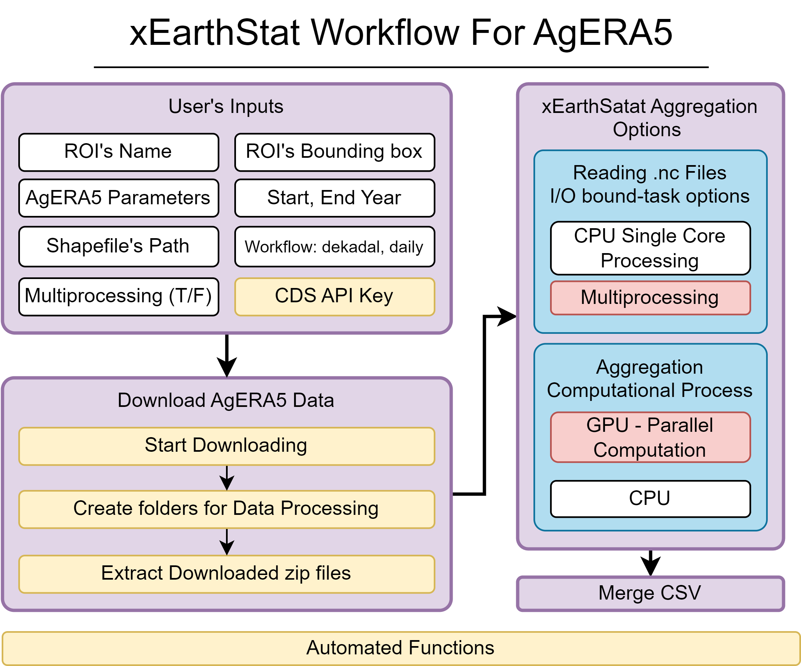

# Welcome to EarthStat
<div style="display: flex; justify-content: center; align-items: center; height: 30vh;"></div>


[](https://pypi.python.org/pypi/earthstat)
[](https://pepy.tech/project/earthstat)
[](https://opensource.org/licenses/MIT)
[](https://anaconda.org/conda-forge/earthstat)

**A Python package for efficiently generating statistical datasets from raster data for spatial units.**


* GitHub repo: [https://github.com/AbdelrahmanAmr3/earthstat](https://github.com/AbdelrahmanAmr3/earthstat)
* Documentation: [https://abdelrahmanamr3.github.io/earthstat](https://abdelrahmanamr3.github.io/earthstat)
* PyPI: [https://pypi.org/project/earthstat](https://pypi.org/project/earthstat/)
* Free software: MIT license

EarthStat's Library Workflows's Notebooks:

* Main Workflow: [Google Colab](https://colab.research.google.com/github/AbdelrahmanAmr3/earthstat/blob/master/docs/examples/intro.ipynb),
[Binder](https://colab.research.google.com/github/AbdelrahmanAmr3/earthstat/blob/master/docs/examples/intro.ipynb)

* xEearthStat Workflow: [Google Colab](https://colab.research.google.com/github/AbdelrahmanAmr3/earthstat/blob/master/docs/examples/xES.ipynb),
[Binder]()


## Introduction

Inspired by my engagement with the AgML community's "Regional Crop Yield Forecasting" challenge, I created a Python library designed to set benchmarks for Machine Learning (ML) models. The library presents an efficient workflow for extracting statistical information from big remote sensing and climate datasets. Currently, The library presents two workflows. First, for dealing with GeoTIFF files, as the main workflow of EarthStat. In addition, it presents a unique workflow for AgERA5 datasets, which gives the user the power to download a huge amount of different variables using CDS API, extended to extract and aggregate all downloaded data. EarthStat's workflows provide multiprocessing and GPU for parallel computation as an option. This library is particularly suited for creating statistical information datasets for ML models or for environmental analyses and monitoring.

## EarthStat Main Workflow
This diagram illustrates the workflow of the geospatial data processing implemented in EarthStat from the initialized dataset to the created CSV file.


## EarthStat Main Workflow Features

EarthStat revolutionizes the extraction of statistical information from geographic data, offering a seamless workflow for effective data management:

- **Data Initialization & Geo-metadata Readability:** Streamlines the incorporation of datasets into EarthStat workflow, and getting insights of vital geo-metadata for data (Raster, Mask, Shapefile).

- **netCDF Conversion:** Seamlessly integrates netCDF files into the workflow, converting them effortlessly into GeoTIFF format.

- **Data Compatibility Assurance:** Simplifies ensuring data compatibility, swiftly identifying and addressing geo data discrepancies among initialized data (Raster, Mask, Shapefile).

- **Automated Resolution of Compatibility Issues:** EarthStat resolves compatibility concerns, employing automatic resampling or reprojecting techniques for masks, and appropriate projection adjustments for shapefiles.

- **Targeted Region Selection:** Easily filter the shapefile to the targeted region.

- **Data Clipping:** Allows for clip raster data to specific shapefile boundaries.

- **Advanced Statistical Data Extraction:** Offers a variety of statistical aggregation methods.

- **Efficient Parallel Processing:** Leverages the power of multiprocessing, significantly accelerating data processing across extensive datasets for quicker, more efficient computation.

## xEarthStat Workflow For AgERA5
This diagram illustrates the workflow of xEearthStat for AgERA5 data processing.




## EarthStat Main Workflow Features
- **Unlimited AgERA5 Data Downloads**: The EarthStat workflow enables users to bypass the limitations of the CDS server, allowing for the download of any quantity of data for the required variables.
- **Fully Automated**: This library is entirely automated and does not require any prior Python knowledge. Users simply need to select the variables for download and aggregation, specify the start and end years to determine the data volume, and define the shapefile containing the geometry objects.
- **Parallel Computation**: EarthStat workflow intelligently detects GPU availability to shift aggregation processes for parallel computation on the GPU. It also offers users the option to leverage available CPU cores for multiprocessing (Parallel Execution), enhancing I/O-bound tasks.
- **Aggregated Data as CSV**: Ultimately, the workflow provides users with a neatly organized CSV file, compiling all downloaded and aggregated variables.

### xEarthStat Workflow Performance on Google Colab
This table demonstrates the workflow's performance across various configurations, ranging from multiprocessing to GPU usage for parallel computation by using Google Colab.

| Data      | Variables | Number of Geo-Objects | Dataset | Processing Unit            | Time (Run: One Time) min |
|-----------|-----------|-----------------------|---------|----------------------------|--------------------------|
| Two year  | 7         | EU (478)              | Dekadal | CPU – Single Processing    | 13:56                    |
| -         | -         | -                     | Dekadal | CPU – Multiprocessing     | 13:48                    |
| -         | -         | -                     | Daily   | CPU – Single Processing    | 1:20:43                  |
| -         | -         | -                     | Daily   | CPU – Multiprocessing     | 1:18:32                  |
| -         | -         | -                     | Dekadal | T4 GPU – Single Processing | 04:32                    |
| -         | -         | -                     | Dekadal | T4 GPU – Multiprocessing  | 04:12                    |
| -         | -         | -                     | Daily   | T4 GPU – Single Processing | 06:35                    |
| -         | -         | -                     | Daily   | T4 GPU – Multiprocessing  | 06:14                    |

## EarthStat Python Library - Improvements Roadmap
### EarthStat Main Workflow
#### Data Processing and Scenario Management Enhancements 
- [x] offering more statistical options for aggregation.
- [ ] Introduce thresholding option for masks to refine data selection.
- [ ] Refactor Dataloader and Data Compatibility for no mask scenario.

#### Automation for User Convenience
- [ ] Implement automatic detection of the lag between date ranges of predictor data.
- [ ] Automatically identify the column names for countries in the dataset.
- [ ] Enable users to specify date ranges for predictor data, improving data filtering capabilities.

### xEarthStat Workflow for AgERA5
- [ ] Option to mask the AgERA5's data with mask


## Installation
To install EarthStat, ensure you have Python 3.9 or later installed. 

Install with pip:
```
pip install earthstat
```
Install with Conda:
```
conda install conda-forge::earthstat
```
## EarthStat Usage
* [EarthStat Main Workflow](https://abdelrahmanamr3.github.io/earthstat/usage/main_usage)


* [xEearthStat for AgERA5 Workflow](https://abdelrahmanamr3.github.io/earthstat/usage/xES_usage)

