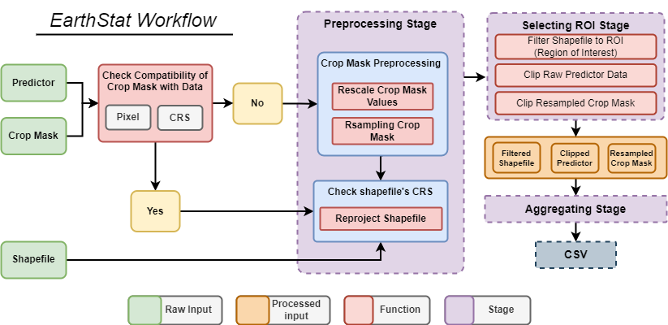

# Welcome to EarthStat

[](https://colab.research.google.com/github/AbdelrahmanAmr3/earthstat/blob/master/docs/examples/intro.ipynb)
[](https://pypi.python.org/pypi/earthstat)
[](https://pepy.tech/project/earthstat)
[](https://opensource.org/licenses/MIT)
[](https://anaconda.org/conda-forge/earthstat)

**Inspired through participating in the AgML community's "Forecast Subnational Yield" activity, this Python library emerges as a vital tool for professionals and researchers engaged with remote sensing raster data. Designed with a focus on processing huge amount of TIFF files, our package excels at extracting statistical information for specific spatial units. By converting raster datasets into easily accessible CSV files. This library Ideal to prepare csv datasets for training Machine Learning (ML) models for different purposes. Also, significantly enhances the ability to leverage remote sensing data for impactful analyses (monitoring climate change, etc.). AgML community and the challenge of forecasting subnational agricultural yields has directly influenced the development of this library, ensuring it meets the high standards required for advanced environmental and agricultural data processing.**

## EarthStat Workflow
This diagram illustrates the workflow of the geospatial data processing implemented in EarthStat.



## Features
EarthStat simplifies geospatial analysis by streamlining the extraction of statistical information from spatial units, providing a comprehensive toolset for efficient data processing and analysis:

- **Easy Data Preparation**: Define directories for raster files, shapefile paths, and masks effortlessly. Our library automates compatibility checks for pixel size, projection, and alignment between raster data (TIFF), mask, and shapefiles, ensuring smooth data integration.

- **Efficient ROI Selection & Raster Clipping**: Select your Region of Interest (ROI) with an intuitive filtering function. Clip raster data to your ROI quickly with just one line of code.

- **Advanced Data Aggregation**: aggregates raster data across selected spatial units but also intelligently masks the raster data during the aggregation process.

- **Comprehensive Data Export**: After aggregation, the library compiles the aggregated data along with related information from the shapefile into CSV files for each spatial unit.


## EarthStat Python Library - Improvements Roadmap
### Data Processing and Scenario Management Enhancements 
- [ ] offering more statistical options for aggregation.
- [ ] Introduce thresholding option for masks to refine data selection.
- [ ] Refactor Dataloader and Data Compatibility for no mask scenario.
- [ ] Merge individual data initialization functions into a single function, streamlining user interaction and input handling.

### Automation for User Convenience
- [ ] Implement automatic detection of the lag between date ranges of predictor data.
- [ ] Automatically identify the column names for countries in the dataset.
- [ ] Enable users to specify date ranges for predictor data, improving data filtering capabilities.

## Installation
To install EarthStat, ensure you have Python 3.8 or later installed. Then run:
```
pip install earthstat
```

## Usage

### Initializing the Library
Import the library using:
```python
from earthstat.earthstat import EarthStat
```

### Main Configuration Setup

Initialize the core settings: assign the predictor variable and data directory, specify the path to the crop mask, and define the shapefile path. Identify the column in the shapefile that contains area or country names.

> **Important:** Be sure to set `invalid_values` to `None` if you do not wish to exclude unprocessed values from the dataset.

```python
predictor_name              = 'FPAR'
predictor_dir               = 'FPAR_Data'
mask_path                   = 'crop_mask/Percent_Maize.tif'
shapefile_path              = 'shapefile/gaul1_asap.shp'
interested_ROI              = ["Norway", "Spain"] 
country_column_name         = 'adm0_name' # Column's name contains countries in shapefile
invalid_values              =[255, 254, 251]  # Set None if no invalid Values
```
> :warning: **Caution:** An increase in ROI size may lead to system crashes due to insuffienct RAM size.


### Initialize the EarthStat object
```python
aggregate_fpar = EarthStat(predictor_name)
```
### Initialize Predictor/Data Directory, Mask, and Shapefile Path

Set up the foundational paths for your data processing pipeline. This includes initializing the directory for the predictor data, the path for the mask file, and the location of the shapefile. Each step is crucial for ensuring that the subsequent data processing and analysis can proceed smoothly.

#### Example Usage:

```python
# Initialize the predictor data directory
aggregate_fpar.initDataDir(predictor_dir)

# Set the path for the mask file
aggregate_fpar.initMaskPath(mask_path)

# Define the location of the shapefile
aggregate_fpar.initShapefilePath(shapefile_path)
```

### Checking Data Compatibility
Evaluate the compatibility of projections and pixel sizes across the mask, raster, and shapefile to ensure seamless data integration. This check confirms that the projection systems align for the mask, raster, and shapefile, and it also verifies that the pixel sizes between the raster and mask are compatible.
```python
aggregate_fpar.DataCompatibility()
```
### Resolving Data Compatibility Issues
This section addresses how to rectify issues identified by the data compatibility check. It focuses on resolving mismatches in pixel size between the raster and mask, or discrepancies in the Coordinate Reference System (CRS) among the raster, mask, and shapefile. The objective is to ensure uniformity in scale, resolution, and geospatial alignment across all datasets involved in the analysis.

- `rescale_factor`: This parameter allows for the adjustment of the data's scale. By default, it is set to `None`, maintaining the original scale of the data. To alter the scale, specify a new range with a tuple, such as `(0,100)`.
- `resampling_method`: This specifies the technique used to resample the data, with options including `"nearest"`, `"bilinear"`, `"cubic"`, and `"average"`. The default method is `"bilinear"`, suitable for a wide range of applications.

Example usage:

```python
# Disable rescaling and use default bilinear resampling
aggregate_fpar.fixCompatibilityIssues(rescale_factor=None, resampling_method="bilinear")

# Rescale data to a new range (0, 100) and use default bilinear resampling
aggregate_fpar.fixCompatibilityIssues(rescale_factor=(0,100), resampling_method="bilinear")
```

### Selecting Region of Interest (ROI)
Specify the area for data analysis by identifying the region of interest. Configure the target ROI and link it to the corresponding column that designates country or area names within the dataset.

```python
aggregate_fpar.selectRegionOfInterest(interested_ROI,
                                      country_column_name)
```
### Clipping Predictor Data
Clip the predictor data to the boundaries defined in the main shapefile. If no specific Region of Interest (ROI) is selected by the previous function, the entire area within the shapefile will be used for clipping.

```python
aggregate_fpar.clipPredictor()
```
> :warning: **Caution:** Using the main shapefile without filtering may led to system crash or error due to the big amount of objects in original shapefile.

### Executing Data Aggregation
Start data aggregation process, leveraging the clipped predictor data, resampled mask, and the selectively filtered shapefile to perform detailed analysis.

```python
aggregate_fpar.runAggregation()
```
> ❗ **Important:** Currently, the only available method for aggregation is weighted aggregation. Additional options for aggregation are under development and will be introduced soon.
